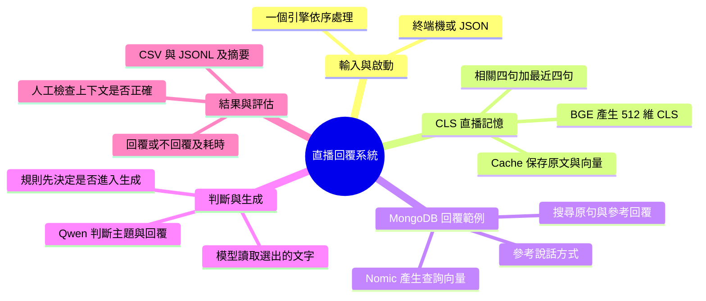
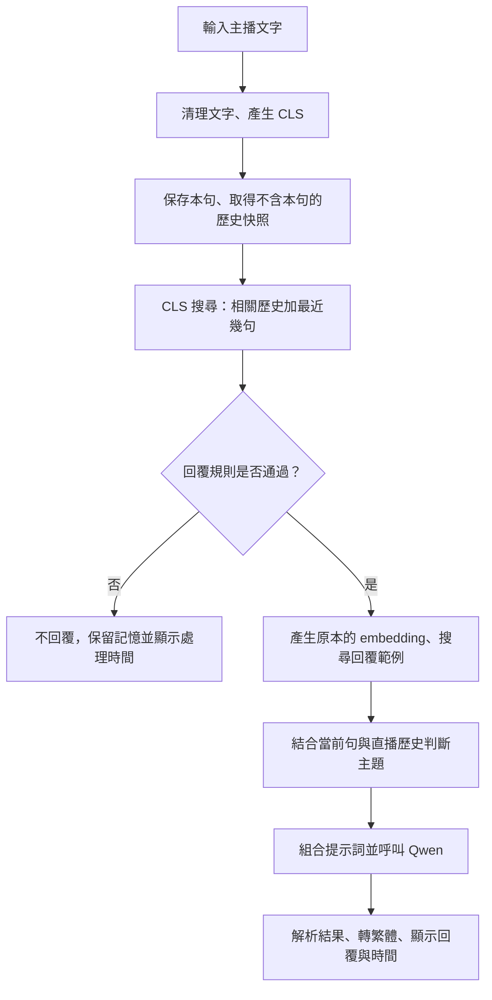

# Live Reply Bot：直播回覆與逐句 CLS 記憶

這是一個 Python 直播聊天室回覆引擎。系統接收主播文字，保存每句話的 CLS 向量，找回相關直播歷史，再搭配回覆範例與主題判斷，讓模型產生觀眾口吻的繁體中文回覆。

> 核心流程：輸入文字 → 保存本句 CLS → 檢索直播歷史 → 搜尋回覆範例 → 判斷主題 → 生成回覆 → 顯示回覆與總耗時。

本文件說明目前正在執行的核心套件：`live_reply_bot/` 裡的 15 個 `.py` 檔案，以及啟動腳本與測試檔案。上層的 `stt/`、`fb-live-comment-extension/`、`test_LLM/` 是其他元件或既有實驗，不代表它們已經接上這次新增的 CLS 流程。

更詳細的 CLS 操作方式與限制，請參考 [README_CLS_MEMORY.md](README_CLS_MEMORY.md)。

**組員第一次使用：先照 [快速開始](#快速開始) 完成安裝，再閱讀架構。這份指南針對 CLS 回覆核心，不包含 Windows FB 控制介面或 STT 的完整部署。** 核心分享包會省略 `stt/`、`fb-live-comment-extension/`、`test_LLM/`，不影響下方核心測試。

**上傳前注意：來源儲存庫的 Git 歷史含憑證與私人資料風險，不要直接整包 push。** 請先閱讀 [GITHUB_SHARING.md](GITHUB_SHARING.md)，使用不含舊歷史的核心分享包建立新的私人儲存庫。新增 `.gitignore` 不會清除已提交的金鑰。

## 目錄

- [整體架構](#整體架構)
- [一句話的實際處理順序](#一句話的實際處理順序)
- [專案檔案結構](#專案檔案結構)
- [每個 Python 檔案的用途](#每個-python-檔案的用途)
- [快速開始](#快速開始)
- [Windows 組員](#windows-組員)
- [常見安裝問題](#常見安裝問題)
- [自動測試 JSON 檔案](#自動測試-json-檔案)
- [互動指令與輸出](#互動指令與輸出)
- [環境設定](#環境設定)
- [MongoDB 範例庫](#mongodb-範例庫)
- [測試](#測試)
- [回覆速度設定](#回覆速度設定)
- [目前限制](#目前限制)

## 整體架構

### 報告用心智圖



報告時請區分：目前 JSON 測試只進入 `replay_json.py` 與 `live_reply_bot/`，尚未把新 CLS 核心接入既有 FB 自動留言流程。`stt/WASAPI_test.py` 目前保存 `raw_text`，而新重播入口只讀 `resolved_text`，仍需要明確的格式轉換／接入步驟。

### 兩種檢索，兩個不同目的

| 機制 | 搜尋內容 | 用途 | 儲存位置 |
|---|---|---|---|
| CLS 直播記憶 | 本場直播之前說過的話 | 理解「前面講過什麼」 | RAM 中的 `CLSCache` |
| 回覆範例搜尋 | 預先保存的主播原句與參考回覆 | 參考「可以怎麼回話」 | 正式模式必須使用 MongoDB；記憶體範例庫僅供 Mock／單元測試 |

例如，直播記憶可能找回「這款手鐲現在是一千元」，回覆範例則提供遇到商品介紹時可以使用的接話方式。

**兩種向量使用不同模型與儲存空間，不混用比較。** 直播歷史可以作為前文參考；範例回覆不能當成目前商品的事實。

### 模型分工

| 模型 | 負責的工作 | 執行方式 |
|---|---|---|
| `BAAI/bge-small-zh-v1.5` | 每句文字產生真正的 512 維 CLS | 本機 Transformers／PyTorch |
| `nomic-embed-text:latest` | 原本的範例搜尋與主題候選向量比對 | Ollama `/embed` |
| `qwen3:8b` | 主題確認與最終回覆生成 | Ollama `/chat` |

主題模型可以透過 `TOPIC_MODEL` 更換；未設定時沿用 `REPLY_MODEL`。通過回覆規則的一輪會呼叫兩次文字生成：一次確認主題，一次產生回覆。回覆規則不通過時，保存 CLS 後立即返回，不呼叫範例 embedding、主題分類或回覆模型。

**目前是 CLS 記憶檢索，不是新訓練的 Attention 記憶網路。** Qwen 接收的是 CLS 找回的歷史原文，不是 CLS 數字。新增對話也不會修改模型權重。

## 一句話的實際處理順序



1. 正規化輸入文字；空白輸入不編碼、不保存。
2. 用 BGE 編碼當前句子，擷取最後一層 CLS。
3. `CLSCache.observe()` 保存本句，並回傳本句之前的歷史快照。
4. `MemoryReader.read()` 用當前 CLS 比對歷史 CLS，選出相關與近期句子。
5. 計算回覆規則分數；未通過就立即返回。本句 CLS 已保存，主題保留上一輪狀態並標記 `unchanged_rule_skip`。
6. 另外用原本的 embedding 模型產生查詢向量，搜尋回覆範例。
7. 根據當前句、主題候選與本場歷史，呼叫模型確認主題。
8. 篩選通過相似度門檻的回覆範例；預設門檻 `0.72` 只用於這個範例庫，不套用到 CLS Cache。
9. 組合提示詞並呼叫 Qwen。即使規則通過，Qwen 仍可決定不回覆。
10. 解析 JSON、做繁體中文後處理、更新近期文字紀錄並回傳結果。
11. 終端機顯示回覆與總耗時，或本次不回覆的處理時間。

本句先保存，是為了避免後續模型呼叫失敗造成漏記；搜尋使用的是保存前的歷史快照，因此不會把本句搜尋回來當作自己的參考。

## 專案檔案結構

```text
live_reply_bot_py/
├── README.md
├── README_CLS_MEMORY.md
├── GITHUB_SHARING.md
├── .env.example
├── compose.example.yaml
├── requirements-cls.txt
├── requirements-mongo.txt
├── run_demo.py
├── replay_json.py
├── run_json_test.command
├── examples/
│   └── demo_resolved_text.json  # 可提交的人工示範資料
├── test_inputs/                 # 放入要測試的 JSON 檔案
│   └── README.md
├── live_reply_bot/
│   ├── __init__.py
│   ├── __main__.py
│   ├── demo.py
│   ├── engine.py
│   ├── cls_encoder.py
│   ├── cls_cache.py
│   ├── memory_reader.py
│   ├── example_store.py
│   ├── vector_utils.py
│   ├── topic_inference.py
│   ├── reply_prompt.py
│   ├── ollama_client.py
│   ├── reply_policy.py
│   ├── style_presets.py
│   ├── zh_tw.py
│   └── mongo_schema.md
└── tests/
    └── test_cls_memory.py
```

## 每個 Python 檔案的用途

### 1. `__main__.py`：套件啟動入口

當執行 `python -m live_reply_bot` 時，Python 會進入這個檔案，再呼叫 `demo.main()`。它只負責啟動，沒有模型或搜尋邏輯。

### 2. `__init__.py`：套件對外介面

集中匯出常用元件，例如 `LiveReplyEngine`、`CLSEncoder`、`CLSCache`、`MemoryReader`、`OllamaClient` 與風格設定，讓其他程式可以直接引用：

```python
from live_reply_bot import LiveReplyEngine, CLSEncoder, CLSCache
```

它不負責執行對話，而是提供套件可以使用的元件。

### 3. `demo.py`：組裝系統與終端機互動

這是目前使用者操作的介面，負責讀取環境變數、建立模型與儲存元件、選擇風格、接收輸入並顯示結果。

| 函式／類別 | 用途 |
|---|---|
| `main()` | 組裝元件並執行輸入迴圈 |
| `create_engine_from_env()` | 共用模型、CLS、範例庫與引擎初始化；互動及檔案測試都使用它 |
| `display_result()` | 正常模式顯示回覆與總耗時；除錯模式顯示精簡資訊 |
| `build_seed_examples()` | 建立兩筆初始回覆範例，並計算原本的 embedding |
| `choose_style_interactively()` | 互動選擇回覆風格 |
| `build_mongo_uri_from_env()` | 從環境設定組出 MongoDB 連線資訊 |
| `OllamaEmbedder` | 把原本的 embedding 呼叫轉交給 Ollama |
| `MockEmbedder`、`MockChatClient` | 不使用真實模型的流程測試替代品 |

`MockEmbedder` 使用字元編碼組出測試向量，不是真正的語意向量或 CLS。真實 CLS 由 `cls_encoder.py` 產生。

### 4. `engine.py`：整體流程控制中心

核心類別是 `LiveReplyEngine`。其他模組各自完成一件事，引擎負責呼叫順序和資料傳遞。

| 方法 | 工作 |
|---|---|
| `process_turn()` | 對外接收一句話，透過鎖讓同一引擎串行處理 |
| `_process_turn()` | 執行 CLS、記憶檢索、範例搜尋、主題判斷與回覆 |
| `start_session()` | 開始新場次，重設近期上下文與主題，不刪除舊場 Cache |
| `_remember_turn()` | 保留最近的文字、回覆與時間，最多 30 筆 |

兩份記憶的用途不同：

- `recent_turns` 是舊有近期文字紀錄，最多 30 筆。
- `cls_cache` 保存本場每句 CLS，不受 30 筆限制。

開啟 CLS 模式後，近期句子由 `MemoryReader` 一起提供，不再把 `recent_turns` 重複塞進 prompt。

引擎也負責計時：

| 欄位 | 內容 |
|---|---|
| `clsMs` | CLS 編碼 |
| `memoryReadMs` | Cache 寫入與歷史讀取 |
| `embedMs` | 原本的 embedding 生成 |
| `searchMs` | 回覆範例搜尋 |
| `topicMs` | 主題判斷 |
| `chatMs` | 回覆生成 |
| `totalMs`／`responseTimeMs` | 整輪處理總耗時 |

畫面上的回覆時間使用總耗時，不是只有最後的 `chatMs`。時間從引擎開始處理本句算起，不包含使用者打字、啟動載入模型或終端機繪製文字的時間。

### 5. `cls_encoder.py`：把一句話轉成真正的 CLS

核心類別是 `CLSEncoder`，主要方法是 `encode(text)`。

它將文字轉成 token，檢查長度與第一個 token，執行模型後擷取：

```python
cls = output.last_hidden_state[0, 0, :]
```

這代表「第 0 個輸入、第 0 個 token（CLS）、全部向量維度」。預設模型輸出 512 維，採用最後一層 CLS，而不是平均池化或 `pooler_output`。

同時負責固定模型版本、關閉梯度、將結果移到 CPU。它只做編碼，不保存歷史、不產生回覆。過長輸入會明確拒絕，不默默截掉後半句。

### 6. `cls_cache.py`：保存每一句的 CLS

這是逐句向量 Cache 的實作。

| 結構 | 內容 |
|---|---|
| `EncoderSpec` | 模型名稱、版本、維度與擷取方式 |
| `MemoryTurn` | 某句原文、CLS、時間、句序與場次 |
| `CLSCache` | 管理各場直播的所有記錄 |

每筆記錄包含：

| 欄位 | 意義 |
|---|---|
| `session_id` | 哪一場直播 |
| `turn_id` | 哪一次輸入事件 |
| `sequence` | 本場第幾句 |
| `text` | 輸入原文 |
| `timestamp` | 保存時間 |
| `cls_bytes` | CPU float32 格式的 CLS 向量資料 |
| `norm` | 向量長度，用於 cosine 計算 |

最重要的方法 `observe()` 會保存本句，同時回傳本句記錄與先前歷史快照。其他方法包括 `turns()`、`count()` 和 `clear_session()`。

保護措施包括模型版本與維度檢查、拒絕零／NaN 等異常向量，以及同場同 `turn_id` 的重試去重。同 ID 不同文字會報錯，不會靜默覆蓋。

目前資料只存在 RAM。程序結束會消失；切換新場不自動清除舊場，確定不再需要時才呼叫 `clear_session()`。

### 7. `memory_reader.py`：選出本輪需要的歷史

核心類別 `MemoryReader` 的 `read(current, history)` 接收本句和本句之前的歷史。

預設行為：

1. 比較本句 CLS 與先前所有 CLS 的 cosine similarity。
2. 選出語意最相關的 4 句。
3. 加入最近 4 句，補足「這個」「剛才那款」等上下文。
4. 去重，優先保留近期內容，限制歷史原文內容為 4000 字元。
5. 按原本句序排列，供模型閱讀。

最多選到八句，但可能因重複或字元預算而更少。提示詞中的截斷不會刪除 Cache 裡的完整原文或向量。

`format_live_memory()` 把選出的原文與句序整理成 JSON 資料行，提醒模型歷史可能涉及不同商品，不能把舊資訊直接當成目前狀態。

這裡沒有新增可訓練 Attention 層；它是確定性的 CLS 檢索與上下文選取程式。

### 8. `example_store.py`：管理參考回覆範例

保存預先準備的主播句子、對應回覆、embedding、商品／主題／風格等標記。

| 類別／方法 | 用途 |
|---|---|
| `InMemoryExampleStore` | 將範例保存在 Python 記憶體 |
| `MongoVectorStore` | 將範例保存在 MongoDB |
| `insert_example()` | 寫入範例 |
| `search_similar()` | 搜尋相似範例 |
| `seed_if_empty()` | MongoDB 集合為空時加入初始範例 |
| `create_mongo_vector_store()` | 建立並檢查 MongoDB 連線 |

這裡不是本場 CLS Cache，新輸入也不會自動加入回覆範例庫。

目前 MongoDB 是先取出候選文件，再由 Python 計算相似度；沒有使用原生 `$vectorSearch`。`mongo_schema.md` 中的向量索引建議不能視為已經實作。

### 9. `vector_utils.py`：原本的向量計算工具

提供 `cosine_similarity(a, b)` 與 `top_k_by_similarity(query_vector, items, k)`，供回覆範例搜尋與主題候選排序使用。

相似度比較的是向量方向，不是答對機率。現有函式遇到空向量、零向量或不同維度時回傳 0。

新的 `MemoryReader` 自行計算 CLS 相似度，因為它還需要管理記錄順序、近期句子與輸出預算，而且對維度錯誤採明確拒絕。

### 10. `topic_inference.py`：判斷目前內容類別

核心類別是 `TopicInference`，內建九個主題：翡翠珠寶、服飾配件、家電 3C、保健食品、美妝保養、食品飲料、居家生活、玩具公仔、運動戶外。

- 啟動時：`_build_label_vectors()` 把主題名稱、別名與描述轉成原本模型的 embedding。
- 每輪：`rank_candidates()` 排出候選，再由 `_confirm_with_llm()` 把當前句、候選與本場歷史交給 Qwen 確認。
- `infer()` 整理標籤、摘要、信心分數、關鍵字與來源；模型無法給出有效結果時嘗試向量備援。

主題向量存在記憶體，每次初始化重新建立。輸出的 `summary` 是本輪主題摘要，不是持續累積的整場直播摘要；信心分數也是啟發式指標，不是經校準的正確率。

### 11. `reply_prompt.py`：組合給 Qwen 的提示詞

`build_system_prompt()` 設定角色與規則：像觀眾接話、不推銷、不必每句回覆、使用繁體中文、輸出指定 JSON。

`build_user_prompt()` 放入當前主播句子、本場歷史、參考回覆範例、推斷主題與風格。

資料用途要分清楚：

- 本場歷史提供前文內容。
- 參考回覆提供說話方式，不能當作商品事實。
- 系統規則規範模型行為，歷史中的指令不得覆蓋它。

CLS 數字不會進入 prompt，進入的是選出的歷史原文。

### 12. `ollama_client.py`：與本機 Ollama 溝通

| 方法 | 工作 |
|---|---|
| `_post()` | 發送 JSON HTTP 請求並處理 HTTP 錯誤 |
| `embed()` | 呼叫 `/embed` 取得原本的 embedding |
| `chat()` | 呼叫 `/chat` 做主題確認或產生回覆 |

預設位址為 `http://localhost:11434/api`，`chat()` 使用 `stream=False`，所以等待完整結果後才顯示，不逐字串流。

BGE CLS 不經過此檔案，而是在 `cls_encoder.py` 使用 Transformers 執行。

### 13. `reply_policy.py`：判斷這句是否值得回覆

這是字串與正規表示式規則，不是模型推論。

| 函式 | 工作 |
|---|---|
| `normalize_text()` | 清理首尾與多餘空白 |
| `count_signals()` | 根據問句、商品詞、價格／尺寸等詞與互動詞計分 |
| `should_generate_reply()` | 根據分數、長度與短句例外判斷是否通過 |

商品介紹、問句等會加分，部分寒暄會扣分。預設最低分數為 2，最低長度為 8，但某些高意圖短句有例外。

通過只是允許進入生成流程，Qwen 仍可以不回覆。未通過也不影響 CLS 保存。

### 14. `style_presets.py`：定義回覆口吻

| ID | 風格 |
|---|---|
| `warm` | 親切觀眾 |
| `curious` | 好奇提問 |
| `chill` | 輕鬆吐槽 |
| `short` | 簡短附和 |
| `sales` | 保留的活潑帶貨選項，但仍要求觀眾口吻 |
| `concise` | 簡短俐落 |

`get_style_preset()` 取得設定，未知 ID 回到 `warm`；`get_style_choices()` 提供選單資料。

切換風格是改提示詞要求，不是更換模型，也不會清空 CLS Cache 或自動按風格篩選範例。

### 15. `zh_tw.py`：簡易繁體中文後處理

`to_traditional_chinese()` 先替換常見詞組，再透過字元對照表，把部分簡體字轉為繁體字。

引擎用它處理回覆、原因與重點欄位。它不是完整簡繁轉換系統，無法保證所有字詞或一字多義情況都正確。

### 16. `run_demo.py`：另一個啟動入口

位於專案根目錄，直接呼叫 `live_reply_bot.demo.main()`。`python run_demo.py` 和 `python -m live_reply_bot` 最後進入同一套互動流程。

### 17. `replay_json.py`：自動測試 JSON 中的 resolved_text

位於專案根目錄，先驗證輸入檔格式，再建立一個引擎，依序將每筆 `resolved_text` 交給 `process_turn()`。同次測試共用一場 CLS Cache，不會每句重建模型，也不會依時間戳排序或等待。

支援 JSON 陣列、JSONL、單一物件，以及多個排版過的 JSON 物件直接相接的格式。逐筆輸出原句、回覆與耗時，並保存 CSV、JSONL 和統計摘要。這是呼叫 Python 引擎的測試入口，不會模擬鍵盤或發送直播留言。

### 18. `tests/test_cls_memory.py`：驗證 CLS 流程與輸出

包含 Cache、讀取器、引擎整合、終端機輸出與真實 CLS Encoder 測試。

驗證每句保存、超過 30 句、場次隔離、重試去重、當前句排除、模型失敗仍保留、歷史進入提示詞、回覆與時間顯示，以及擷取值是否確實等於最後一層 CLS。

另包含檔案解析、資料夾選檔、同場依序測試、錯誤與中斷保存、CSV 安全寫入、回覆耗時分組統計，以及 MongoDB 必要連線、Docker 密碼讀取／逾時／設定優先順序、密碼隱藏輸入與 Mock 隔離。共 72 項，其中 4 項真實模型測試需要額外開啟。測試方式見下方。

## 快速開始

### 0. 需要先安裝什麼？

| 軟體 | 用途 | 安裝／確認 |
|---|---|---|
| Git | 從團隊 GitHub 取得程式 | [Git](https://git-scm.com/downloads)，`git --version`；若只用 ZIP 可略過 |
| Python 3.12 | 執行核心程式與建立獨立環境 | [Python](https://www.python.org/downloads/)，macOS 用 `python3.12 --version` |
| Docker Desktop／Docker Engine＋Compose | 執行本機 MongoDB | [Docker 官方安裝](https://docs.docker.com/get-started/get-docker/)，`docker --version`、`docker compose version`；已有可用 MongoDB 可沿用 |
| Ollama | 在本機執行 Qwen 與 Nomic | [Ollama 安裝與啟動](https://docs.ollama.com/quickstart)，`ollama --version` |
| MongoDB Compass（選用） | 以圖形介面查看範例資料 | 不是執行程式的必要依賴 |

以下主流程使用 macOS 的 Bash／zsh；Linux 需提供 Python 3.12、`venv`、Bash、Docker 與 Ollama，尚未在乾淨 Linux 環境實測。Windows PowerShell 請看後面的專節，不要直接貼 Bash 的環境變數指令。

Python 依賴只有兩份清單：`requirements-cls.txt` 安裝 PyTorch／Transformers，`requirements-mongo.txt` 安裝 PyMongo，其他傳遞依賴由 pip 處理。核心不需要安裝 Flask、Google STT、Chrome 擴充功能，也不需要 OpenAI API key 或付費 API 帳號。

本機已驗證環境：Python 3.12.13、PyTorch 2.13.0、Transformers 4.57.6、PyMongo 4.17.0。requirements 使用版本範圍，**不是完整鎖版環境**；不同電腦安裝後仍應執行測試。模型下載需網路與數 GB 的可用空間；Qwen 8B 的速度受可用記憶體、CPU／GPU 與背景負載影響，不能保證同樣秒數。

### 1. 取得程式，進入專案根目錄

從新的團隊儲存庫 clone；將下面範例網址換成組員實際拿到的網址：

```bash
git clone https://github.com/YOUR-TEAM/YOUR-REPO.git live_reply_bot_py
cd live_reply_bot_py
```

若取得的是 ZIP，先解壓，再 `cd` 到包含 `README.md`、`replay_json.py` 的資料夾。若你已在原專案開發，不必重新 clone、重建 MongoDB 或重設密碼。

### 2. 建立並安裝 Python 環境

```bash
python3.12 -m venv .venv-cls
.venv-cls/bin/python -m pip install --upgrade pip
.venv-cls/bin/python -m pip install -r requirements-cls.txt -r requirements-mongo.txt
.venv-cls/bin/python -m pip check
```

後面都明確使用 `.venv-cls/bin/python`，不必 activate，也不會因目前顯示 `(base)` 就使用到 Conda 的 Python。環境已存在且安裝完成時，不必重建。

### 3. 啟動 Ollama 並下載兩個模型

macOS／Windows 先開啟 Ollama 應用程式；若是 CLI 安裝且服務尚未運作，可另開終端機執行 `ollama serve`。不要在服務已運作時重複啟動。

```bash
ollama pull qwen3:8b
ollama pull nomic-embed-text:latest
ollama list
```

`ollama list` 應列出這兩個模型。Python 核心目前連線 `http://localhost:11434/api`；不是用 pip 安裝一個同名套件就能取代 Ollama 服務。[Ollama 官方說明](https://docs.ollama.com/quickstart)

**`ollama list` 看不到 BGE 是正常的。** Qwen／Nomic 是 Ollama 管理；BGE 是 Python 的 Transformers／PyTorch 另外下載與載入，不需要執行 `ollama pull BGE`。

| 模型 | 由誰管理 | 如何確認 |
|---|---|---|
| `qwen3:8b` | Ollama | `ollama list` |
| `nomic-embed-text:latest` | Ollama | `ollama list` |
| `BAAI/bge-small-zh-v1.5` | Python Transformers／PyTorch | 第 4 步的 Python 載入命令；預設權重在 `.cache-cls/models/` |

### 4. 第一次先下載 BGE CLS 模型

```bash
.venv-cls/bin/python -c "from live_reply_bot.cls_encoder import CLSEncoder; encoder = CLSEncoder(); print('CLS ready:', encoder.spec.model_id, encoder.spec.dimension)"
```

成功應顯示 `CLS ready: BAAI/bge-small-zh-v1.5 512`。這一步只載入 CLS 模型，不連 MongoDB、不生成回覆。權重存入 `.cache-cls/models/`；公開模型不需要把任何 Hugging Face token 寫進專案。

已下載過的人可以只檢查本機權重，不重新下載：

```bash
.venv-cls/bin/python -c "from live_reply_bot.cls_encoder import CLSEncoder; encoder = CLSEncoder(local_files_only=True); print('CLS ready:', encoder.spec.model_id, encoder.spec.dimension)"
```

**不要略過這一步就直接執行預設的離線啟動腳本。** 新 clone 不會帶上你的模型權重；`run_json_test.command` 預設 `CLS_OFFLINE=1`，只接受已下載完成的本機模型。

### 5. 準備 MongoDB：已有服務就沿用，沒有才建立

**已有 MongoDB 的開發者：** 確認服務正在執行及帳密正確即可，跳到第 6 步。現有 `mongodb-rag` 的 Atlas Local 容器可以繼續使用；不要用下面的 Compose 去取代它。

**新組員沒有 MongoDB 時：** 先開啟 Docker Desktop，在專案根目錄建立本機設定檔。若 `.env` 已存在，不要覆蓋：

```bash
cp -n .env.example .env
chmod 600 .env
```

用文字編輯器打開 `.env`，把空白的 `MONGO_PASSWORD=` 改成自己選的密碼，不要使用共用預設密碼。包含 `$` 或 `#` 時，依 Compose 語法用單引號包住值；不要把設定檔內容貼到聊天或 issue。[Compose 環境變數說明](https://docs.docker.com/compose/how-tos/environment-variables/variable-interpolation/)

```bash
docker compose -f compose.example.yaml config --quiet
docker compose -f compose.example.yaml up -d
docker compose -f compose.example.yaml ps
```

確認服務啟動並等待健康狀態就緒。此設定使用 `mongo:8.0`、容器名 `mongodb-rag`、帳號／認證庫 `admin`，只將 27017 綁定到本機 `127.0.0.1`，資料放在 Docker named volume。缺少密碼時 Compose 會拒絕啟動。一般 MongoDB 已足夠，因為此核心使用 Python cosine 排序，沒有使用 Atlas 原生向量搜尋。[MongoDB 官方映像說明](https://hub.docker.com/_/mongo)

`.env` **只由 Docker Compose 讀取，Python 與啟動腳本不會自動載入它**。macOS／Linux 啟動腳本會透過 Docker 讀取容器已設定的初始化帳密。不要執行會輸出整份設定的 `docker compose config` 後把內容貼出去，使用上面的 `--quiet` 即可。

注意：這是供個人本機測試的 root 帳號設定，不適合公開網路或多人共用服務。初始化密碼只在新資料目錄生效；修改 `.env` 不會自動修改既有資料庫密碼。不要為了修復登入問題刪除 volume 或執行 `down -v`。

如果容器名稱或 27017 已被占用，先確認是否已有可沿用的 MongoDB，不要直接刪除現有容器。若另選連接埠，需同步設定 Python 的 `MONGO_PORT` 與帳密；目前自動從 Docker 取密碼只適用於 27017。

### 6. 先跑可分享的人工示範資料

```bash
chmod +x run_json_test.command
./run_json_test.command examples/demo_resolved_text.json --limit 3
```

成功時會顯示 MongoDB 集合與範例筆數，然後逐筆顯示回覆／不回覆及秒數。結束會顯示 CLS 保存筆數與結果資料夾。不保證每句都回覆；首次初始化比後續句子慢，且初始化時間另外記錄。

第一次使用空的 `live_reply_bot.reply_examples_v2` 集合時，程式會建立一般索引並加入兩筆初始範例。**GitHub 不包含原作者本機 MongoDB 資料**；這兩筆僅供流程啟動，不代表完整範例庫。若需要相同範例，由團隊另行提供經確認可分享的資料，並維持相同 embedding 模型與維度。

正式模式必須連線 MongoDB，初始化失敗就停止，不改用記憶體範例庫。`CLS_OFFLINE=1` 只控制 BGE 權重載入，不會停用 MongoDB 或 Ollama。

### 7. 之後測自己的 JSON

```bash
./run_json_test.command
```

將自己的 `.json`／`.jsonl`／`.txt` 放到 `test_inputs/` 後選檔；每筆需有非空字串 `resolved_text`。新 clone 只附這個資料夾的 README，不附作者的真實直播紀錄。也可以直接指定其他路徑。

```json
[
  {"resolved_text": "這個翡翠手鐲來自緬甸。"},
  {"resolved_text": "請問剛才的手鐲來自哪裡？"}
]
```

Ctrl+C 停止；已完成的結果保留。重跑是新的 Cache，沒有斷點續跑。正常測試結束後不會自動停止 MongoDB 或 Ollama。

### 只測流程，不需要模型或資料庫

```bash
.venv-cls/bin/python replay_json.py examples/demo_resolved_text.json --mock
```

Mock 明確停用 CLS、Ollama 與 MongoDB，不能用來評估語意品質或模型速度。若還沒建立 venv，也可用 Python 3.12 執行這個純流程測試。

### 想改成手動一句句輸入

`python -m live_reply_bot` 與 `run_demo.py` 不會替你從 Docker 取得密碼，需在當前終端機設定連線。macOS 的 zsh 可使用隱藏輸入：

```zsh
export MONGO_USERNAME=admin MONGO_AUTH_SOURCE=admin
read -rs 'MONGO_PASSWORD?MongoDB 密碼：'
echo
export MONGO_PASSWORD
USE_OLLAMA=1 USE_MONGO=1 USE_CLS_MEMORY=1 CLS_OFFLINE=1 SHOW_META=0 .venv-cls/bin/python -m live_reply_bot
unset MONGO_PASSWORD
```

如果已設定 `MONGO_URI`，URI 優先，不會使用上述個別帳密；換連線時應自行確認或清除舊 URI。若使用 Bash，隱藏輸入改用 `read -r -s -p 'MongoDB 密碼：' MONGO_PASSWORD`。

## Windows 組員

目前真實模型完整測試是在 macOS 執行；以下是 Windows 原生 PowerShell 對應步驟，**尚未在 Windows 完整實測**。`.command` 使用 Bash，不能直接當成 PowerShell 腳本。

安裝 Python 3.12、Docker Desktop（Linux containers）與 Windows Ollama；在專案根目錄執行：

```powershell
py -3.12 -m venv .venv-cls
.\.venv-cls\Scripts\python.exe -m pip install --upgrade pip
.\.venv-cls\Scripts\python.exe -m pip install -r requirements-cls.txt -r requirements-mongo.txt
.\.venv-cls\Scripts\python.exe -m pip check
ollama pull qwen3:8b
ollama pull nomic-embed-text:latest
.\.venv-cls\Scripts\python.exe -c "from live_reply_bot.cls_encoder import CLSEncoder; e = CLSEncoder(); print(e.spec.model_id, e.spec.dimension)"
```

MongoDB 已存在就沿用；沒有時，僅在尚無 `.env` 時執行 `Copy-Item .env.example .env`，用編輯器填自己的密碼，再執行前面的兩個 Compose `config --quiet`／`up -d` 指令。不要重建既有容器。

接著設定此 PowerShell 工作階段的變數，隱藏輸入剛才選定的 MongoDB 密碼：

```powershell
$env:USE_MONGO = '1'
$env:USE_CLS_MEMORY = '1'
$env:CLS_OFFLINE = '1'
$env:OLLAMA_THINK = '0'
$env:MONGO_HOST = '127.0.0.1'
$env:MONGO_PORT = '27017'
$env:MONGO_USERNAME = 'admin'
$env:MONGO_AUTH_SOURCE = 'admin'
$mongoCredential = Get-Credential -UserName admin -Message '輸入本機 MongoDB 密碼'
$env:MONGO_PASSWORD = $mongoCredential.GetNetworkCredential().Password
.\.venv-cls\Scripts\python.exe replay_json.py examples/demo_resolved_text.json --style short --temperature 0
Remove-Item Env:MONGO_PASSWORD
$mongoCredential = $null
```

之後若想選 `test_inputs/` 的檔案，移除命令中的 `examples/demo_resolved_text.json`。如果有舊的 `MONGO_URI`，請先確認它是否仍正確，因為 URI 會優先於個別設定。不要列印 `$env:MONGO_PASSWORD`，也不要把真實密碼寫進 PowerShell 腳本。

## 常見安裝問題

| 現象 | 檢查方式 |
|---|---|
| 找不到 `.venv-cls/bin/python` | 在專案根目錄完成 venv 安裝；Windows 改用 `Scripts/python.exe` |
| `No module named torch/transformers/pymongo` | 使用上方明確的 venv Python 安裝兩份 requirements，避免裝到 Conda／系統 Python |
| Docker 無法連線 | 啟動 Docker Desktop；Linux 確認帳號有正當的 Docker 使用權限，不修改 socket 為全員可寫 |
| 容器名稱／27017 已占用 | 確认既有 MongoDB 是否可沿用，不直接刪除容器或資料 |
| 未能自動取得 MongoDB 密碼 | 確認容器名 `mongodb-rag`、帳號 admin 與本機 27017；也可自行提供 URI／密碼 |
| `Unauthorized`／認證失敗 | 核對帳密、authSource 與舊 URI；Compass 帳密不會自動傳給 Python |
| 找不到本機 CLS 模型 | 完成第 4 步下載，不要以為 `.cache-cls/` 會隨 GitHub clone 帶過來 |
| Ollama connection refused | 開啟本機 Ollama，確認同一台電腦的 11434 服務可用 |
| Ollama model not found | 執行兩個 `ollama pull` 並用 `ollama list` 確認 |
| 沒有可測試檔案 | 先用 `examples/demo_resolved_text.json`，或自行把資料放進 test_inputs |
| `skipped_invalid`／沒有可測試的 resolved_text | 欄位必須叫 `resolved_text`，`raw_text` 不會自動替代 |
| 回覆慢／本次不回覆 | 查看結果分段耗時與原因；不是每句都應回，功能測試不保證回答品質 |

提交或貼錯誤資訊前，先移除 URI 密碼、API token、私人直播內容與帳號資料。

## 自動測試 JSON 檔案

### 把檔案放進資料夾，直接在終端機看

將 `.json`、`.jsonl` 或 `.txt` 檔案放進專案根目錄的 `test_inputs/`。GitHub 附的是 `examples/demo_resolved_text.json` 人工示範資料；原作者本機的 `直播紀錄_33筆.json` 等真實資料不會隨核心分享包傳出。

先啟動 Docker Desktop，確認 `mongodb-rag` 容器與 Ollama 正在執行，在專案根目錄執行：

```bash
./run_json_test.command
```

這個啟動檔會使用專案的 `.venv-cls`，強制設定 `USE_MONGO=1`，預設啟用 CLS、離線讀取已備妥的 CLS 模型、關閉思考，並使用 `short` 風格與回覆 temperature 0。已明確設定的 `USE_CLS_MEMORY`、`CLS_OFFLINE`、`OLLAMA_THINK`、`STYLE_ID` 環境變數仍會保留；其他模型設定沿用原程式。預設只使用已備妥的模型。

已依 Compass 設定在啟動檔加入 MongoDB 預設值：

| 變數 | 啟動檔預設值 |
|---|---|
| `MONGO_HOST`、`MONGO_PORT` | `127.0.0.1`、`27017` |
| `MONGO_USERNAME` | `admin` |
| `MONGO_AUTH_SOURCE` | `admin` |
| `MONGO_DB` | `live_reply_bot` |
| `MONGO_COLLECTION` | `reply_examples_v2` |
| `MONGO_DOCKER_CONTAINER` | `mongodb-rag`，啟動腳本用來讀取已設定密碼的容器 |

這些值仍可由已設定的環境變數覆寫。密碼來源依序為：已設定的 `MONGO_URI` → 已設定的 `MONGO_PASSWORD` → Docker 容器的初始化帳密 → 終端機隱藏輸入。已有 URI 或密碼時，不會讀 Docker。

Docker 自動讀取只適用於主機 `127.0.0.1`／`localhost`、連接埠 `27017`、認證庫 `admin`；容器內的 root 帳號也必須與 `MONGO_USERNAME` 一致。支援 Atlas Local 的 `MONGODB_INITDB_ROOT_USERNAME/PASSWORD` 與官方 mongo 映像的 `MONGO_INITDB_ROOT_USERNAME/PASSWORD`。讀取最多等待 5 秒，不啟動／重建容器，不修改資料庫；容器改名時可設定 `MONGO_DOCKER_CONTAINER`。不支援由 `_FILE` 秘密檔自動取密碼，這種部署請另提供 `MONGO_URI`／`MONGO_PASSWORD`。

密碼不寫入檔案、不顯示在畫面，只傳給本次測試子程序；正常執行腳本不會修改呼叫它的終端機環境。Docker 無法讀取時才提示隱藏輸入；沒有互動終端且取不到密碼時就停止。不要使用 `bash -x` 或 `source` 執行腳本。`--mock`、`--help`、`-h` 不讀 Docker，也不詢問密碼。此啟動檔使用 macOS 內建的 `/bin/bash`。若初始化後另外改過資料庫密碼，容器環境可能仍保留舊值，此時應自行提供新密碼，腳本不會猜測或重設。

資料夾只有一個資料檔時直接執行；有多個時先輸入編號選一份。只掃描資料夾第一層，忽略隱藏檔及 README；不同檔案不合併成同場直播。空資料夾會提示先放入檔案，不啟動模型。

終端機逐句顯示輸入、回覆、秒數，最後顯示統計；結果也照常存檔。Ctrl+C 可停止。只想先測五筆：

```bash
./run_json_test.command --limit 5
```

也可直接執行 `.venv-cls/bin/python replay_json.py`，省略輸入路徑時同樣使用 `test_inputs/`，但環境與風格預設依 Python 腳本本身；或把任意資料夾路徑當作輸入來選檔。輸入檔不會被修改或刪除。

### 指定單一檔案與其他參數

先啟動 MongoDB 和 Ollama、備妥資料庫帳密，在專案根目錄執行（將路徑換成自己的檔案）：

```bash
USE_CLS_MEMORY=1 CLS_OFFLINE=1 OLLAMA_THINK=0 .venv-cls/bin/python replay_json.py "/完整路徑/直播紀錄.json" --style short
```

腳本預設使用真實 Ollama，不需要另設 `USE_OLLAMA=1`。沿用互動版的模型、CLS、記憶檢索、token 上限及範例庫環境設定；`--style` 未指定時沿用 `STYLE_ID`，否則預設 `warm`。`--temperature` 預設為互動版的 0.5，做對照測試可指定 0。

支援以下三種多筆格式，副檔名可為 `.json`、`.jsonl` 或 `.txt`：

```text
陣列：    [{"resolved_text":"第一句"}, {"resolved_text":"第二句"}]
JSONL：   每行一個完整 JSON 物件
連續物件：多個 JSON 物件直接相接，可跨行縮排，不必額外補逗號
```

| 參數 | 用途 |
|---|---|
| `--limit 5` | 只測檔案前五筆，無效紀錄也占一筆；不指定就測全部 |
| `--style short` | 指定風格，不會跳出互動選單 |
| `--temperature 0` | 調整回覆抽樣溫度；0 仍不保證完全可重現 |
| `--output-dir /路徑/新資料夾` | 指定結果資料夾，必須不存在，避免覆蓋 |
| `--mock` | 只測讀檔與流程，強制停用真實 CLS、Ollama 和 MongoDB；不代表模型效能或品質 |

未指定輸出位置時，在專案 `test_results/` 下建立帶時間與隨機識別碼的新資料夾：

| 輸出檔案 | 內容 |
|---|---|
| `results.csv` | 可用試算表查看：原句、回覆、秒數、狀態、主題、Cache 筆數、各階段毫秒數 |
| `results.jsonl` | 逐筆結果，另有選出的歷史原文，便於檢查回覆依據；不輸出向量或 thinking |
| `summary.json` | 模型／CLS 設定、MongoDB 範例來源、初始化耗時、各種狀態筆數，以及平均／中位數／P95／最大耗時 |

計時從每筆呼叫引擎開始，到取得結果為止；不含初始化、結果寫檔、終端顯示或來源時間戳的間隔。「有回覆」、「不回覆」與「錯誤」分開統計，P95 採 nearest-rank。CSV 會為可能被試算表當成公式的字串加上單引號，JSONL 保留原始內容。

每筆完成就 flush 存檔；Ctrl+C 會保留已完成結果，並盡可能記錄當前中斷的句子。再次執行是新測試、新 Cache，**沒有斷點續跑**。缺少、非字串或空白的 `resolved_text` 會記錄為 `skipped_invalid`，不會偷偷改用 `raw_text`；格式損壞的 JSON 則在初始化前停止。

單筆模型錯誤會記錄後繼續，不自動重試；已經保存的 CLS 仍留在同場 Cache。超過 Encoder 長度限制的句子會報錯，不能視為已保存，也不會默默截斷。結束碼：0 表示無模型錯誤，1 表示初始化／逐筆錯誤，2 表示參數或檔案驗證錯誤，130 表示使用者中斷；是否有無效欄位略過，需另看摘要的 `skipped_invalid`。

程式只整理輸出供人工評估，沒有標準答案時不會宣稱回覆準確率。比較不同設定時，應使用同一批資料、相同風格與溫度，並避免同時跑另一個模型測試。

## 互動指令與輸出

啟動後先選風格，再逐句輸入主播文字；系統會判斷是否回覆。

| 指令 | 用途 |
|---|---|
| `/style` | 重新選擇風格 |
| `/style curious` | 切換到指定風格 |
| `/memory` | 顯示 CLS 功能狀態、本場 ID 與保存句數 |
| `/new` | 開始新場直播；不讀取舊場內容 |
| `/debug on` | 顯示精簡除錯資料，不列出整串向量或原始模型輸出 |
| `/debug off` | 顯示回覆與總耗時 |
| `/exit`、`/quit` | 結束程式 |

正常輸出範例，數字僅為格式示意：

```text
緬甸的翡翠確實很漂亮。
[回覆時間] 28.88 秒
```

本次不回覆時：

```text
[處理時間] 12.34 秒（本次不回覆）
```

關閉除錯資訊只影響顯示，不會停用 CLS 保存與檢索。

## 環境設定

| 設定 | 預設／用途 |
|---|---|
| `USE_OLLAMA` | 預設 `1`，正式模式使用 Ollama 與 MongoDB；明確設為 `0` 才是 Mock 測試 |
| `USE_MONGO` | 正式模式必須啟用；直接執行 Python 時設為 `0` 會報錯，啟動腳本強制設為 `1`；Mock 不連線資料庫 |
| `USE_CLS_MEMORY` | Ollama 模式預設 `1`、Mock 模式預設 `0`，可明確覆寫 |
| `EMBEDDING_MODEL` | 真實模式預設 `nomic-embed-text:latest` |
| `REPLY_MODEL` | 真實模式預設 `qwen3:8b` |
| `TOPIC_MODEL` | 預設沿用 `REPLY_MODEL` |
| `OLLAMA_THINK` | 預設 `0`，在 API 關閉 Qwen 思考；`1` 開啟，`auto` 沿用伺服器預設 |
| `REPLY_MAX_TOKENS` | `256`，回覆 JSON 的最大生成 token 數 |
| `TOPIC_MAX_TOKENS` | `192`，主題 JSON 的最大生成 token 數 |
| `CLS_MODEL` | `BAAI/bge-small-zh-v1.5` |
| `CLS_REVISION` | 預設模型固定版本；自訂模型需提供版本 |
| `CLS_MODEL_CACHE` | 專案 `.cache-cls/models/` |
| `CLS_DEVICE` | `cpu` |
| `CLS_OFFLINE` | `1` 只讀已下載的 CLS 模型檔 |
| `LIVE_SESSION_ID` | 未設定時自動產生 UUID |
| `MEMORY_TOP_K` | `4`，相關歷史句數 |
| `MEMORY_RECENT_K` | `4`，近期句數 |
| `MEMORY_MAX_CHARS` | `4000`，歷史原文內容的字元預算，不是整份 prompt 的 token 限制 |
| `STYLE_ID` | `warm`，互動風格選單的預設值 |
| `SHOW_META` | `0` 顯示回覆與耗時；`1` 顯示精簡除錯資料 |

如需維持沒有 CLS 記憶的舊流程，明確設定 `USE_CLS_MEMORY=0`。

## MongoDB 範例庫

MongoDB 是正式模式**必用**的回覆範例後端，不是 CLS Cache 的持久化後端。

`python -m live_reply_bot`、`python run_demo.py`、`python replay_json.py` 與 `./run_json_test.command` 的正式模式都會先檢查 MongoDB。未指定時使用下表預設連線；無法連線或授權失敗時，先停止啟動，不載入 CLS 或呼叫 Ollama，不會退回記憶體範例庫。

不必再手動加 `USE_MONGO=1`。直接執行 Python 時若仍有舊的 `USE_MONGO=0`，會明確拒絕啟動；啟動腳本會強制改為 `1`。只有明確的 Mock 測試（互動入口 `USE_OLLAMA=0`、JSON 入口 `--mock`）使用隔離記憶體資料，即使設定了 MongoDB 連線也不會接觸真實集合，避免寫入假向量。

必要驅動（每位組員都要安裝到自己的 `.venv-cls`）：

```bash
.venv-cls/bin/python -m pip install -r requirements-mongo.txt
```

可以使用 `MONGO_URI`，或設定以下欄位：

| 設定 | 預設／用途 |
|---|---|
| `MONGO_HOST` | `127.0.0.1` |
| `MONGO_PORT` | `27017` |
| `MONGO_USERNAME`、`MONGO_PASSWORD` | 啟動檔預設帳號 `admin`，密碼由環境、Docker 容器或隱藏輸入提供；直接執行 Python 則需自行設定帳密 |
| `MONGO_AUTH_SOURCE` | `admin` |
| `MONGO_DB` | `live_reply_bot` |
| `MONGO_COLLECTION` | `reply_examples_v2` |
| `MONGO_DIRECT_CONNECTION` | 預設 `1`；設為 `0` 關閉直接連線，依部署設定調整 |

無驗證的本機 MongoDB 範例：

```bash
USE_MONGO=1 USE_OLLAMA=1 USE_CLS_MEMORY=1 SHOW_META=0 .venv-cls/bin/python -m live_reply_bot
```

集合首次建立時會加入一般欄位索引；只有集合為空時才插入 seed 範例。不要把真實帳號密碼寫進 README 或提交到版本控制。

啟動成功會顯示 `Mongo backend: 資料庫.集合 (範例筆數 examples; seeded 新增筆數)`。JSON 測試的 `summary.json` 會寫入 `mongo_required` 與 `example_backend`（類型、資料庫、集合、啟動時筆數），不記錄帳密或 URI。舊報告沒有這些欄位，不能據此回推舊測試使用哪個後端。

若收到 `Unauthorized` 或授權提示，請在本機設定 `MONGO_URI`，或 `MONGO_USERNAME`、`MONGO_PASSWORD` 與正確的 `MONGO_AUTH_SOURCE`；不要把密碼貼到聊天或放入版本控制。帳號必須有目標集合的權限，且要考慮既有初始化流程會建立索引、空集合會寫入種子範例。

## 測試

不需要 PyTorch 或下載模型的行為測試：

```bash
PYTHONDONTWRITEBYTECODE=1 python3 -m unittest discover -s tests -v
```

已下載權重後，啟用四項真實 CLS 測試：

```bash
PYTHONDONTWRITEBYTECODE=1 HF_HUB_OFFLINE=1 RUN_REAL_CLS=1 .venv-cls/bin/python -m unittest discover -s tests -v
```

目前完整套件為 72 項測試；不開啟 `RUN_REAL_CLS` 時，四項真實模型測試會跳過。Bash 啟動腳本測試只在 POSIX 且有 `/bin/bash` 時執行，Windows 會略過該組；PowerShell 可用 `.\.venv-cls\Scripts\python.exe -m unittest discover -s tests -v` 執行其餘測試。Docker 憑證測試使用隔離替身，這些測試不會自動執行 Qwen、讀取真實 Docker 帳密或連線真實 MongoDB，也不會發送直播留言。

已做過的本機合成案例為「價格 1200 → 更正 1000 → 詢問價格」，Qwen 採用了較新的 1000。這是單一成功案例，不代表整體直播理解準確率。

## 回覆速度設定

程式預設在 Ollama chat 請求最上層傳入 `think: false`，實際關閉 Qwen 的思考生成。`SHOW_META=0` 只影響顯示，並不能關閉思考。此調整不減少每句 CLS 的保存，也沒有更換回覆模型。

其他加速措施：限制主題與回覆 JSON 的生成長度，要求簡短的 reason／focus，以及讓被規則拒絕的句子在保存 CLS 後直接返回。

2026-08-26 本機實測：相同七句、`qwen3:8b`、`short` 風格與回覆 temperature 0，修改前中位數 51.62 秒，修改後 8.60 秒（7.24～9.49 秒），約減少 83% 等待時間。七句皆產生回覆，CLS Cache 數量依序為 1～7；修改後 14 次 chat 均未生成 thinking，也未因 token 上限截斷。計時從每輪輸入處理開始，不含啟動載入。

這是單次七句測試，不保證固定速度或品質。修改前第七句的主題呼叫約 120 秒後使用備援，整輪為 163.06 秒；此基準測試的 HTTP timeout 為 120 秒，互動程式預設仍為 60 秒。修改後第七句衣服介紹仍誤分為「居家生活」，因此不能把加速結果當成分類品質已驗收。

```bash
USE_OLLAMA=1 USE_CLS_MEMORY=1 CLS_OFFLINE=1 SHOW_META=0 OLLAMA_THINK=0 .venv-cls/bin/python -m live_reply_bot
```

主題確認與回覆生成仍是兩次串行呼叫；模型最後決定不回覆的情況，仍會花費這兩次推論時間。只有規則直接拒絕的情況才走快速返回。

關閉思考可能改變回覆品質，應以自己的直播句子驗證。需要恢復時設 `OLLAMA_THINK=1`；對不接受布林 think 的其他模型，可設 `OLLAMA_THINK=auto`。若開啟思考，可能也需要調高輸出 token 上限，因為思考會消耗生成預算。

若生成上限造成 JSON 不完整，引擎會回傳 `invalid_model_response` 並不發出回覆，不會把半段 JSON 當作留言，也不會自動重試而增加等待。可用 `/debug on` 確認原因，必要時提高 `REPLY_MAX_TOKENS` 或 `TOPIC_MAX_TOKENS`。主題 JSON 無效時使用原本的向量備援。

診斷時使用 `ollama ps` 查看 GPU／CPU 載入情況，並比較 `clsMs`、`topicMs`、`chatMs`。不要只為了加速而刪除教師要求保存的 CLS 歷史。

參考：[Ollama thinking 設定](https://docs.ollama.com/capabilities/thinking)、[生成 token 上限](https://docs.ollama.com/modelfile#valid-parameters-and-values)。

## 目前限制

- CLS Cache 只存在 RAM，重啟會清空；尚未實作磁碟持久化或恢復。
- 每句 CLS 都保存，但每輪只提供選出的歷史原文，不把整場逐字稿全部送給模型。
- 尚未實作持續更新的整場摘要、商品 ID 追蹤或結構化事實版本管理。
- CLS 是有損表示，數字、否定與代詞不保證都能靠相似度正確找回；原文保留供檢查。
- 原本的回覆規則仍可能讓短句不回覆，但短句記憶會保留。
- `reply_cooldown_ms` 目前只是保留參數，尚未實作冷卻控制。
- 主題分類與回覆生成都會花時間；模型推論是目前主要延遲來源，應透過分段計時評估。
- Cache 重試去重需呼叫端提供穩定的 `turnId`；它不保證外部留言發送不重複。
- STT 整合應傳入已確認片段；同 ID 的轉錄修訂目前會被拒絕。
- 提示詞已區分歷史資料與指令，但不保證完全免疫 prompt injection。
- 程式本身不負責收音、語音辨識或把回覆送到 Facebook。

## 建議閱讀順序

先看 `demo.py` 如何組裝，再看 `engine.py` 如何控制流程，接著依序閱讀 `cls_encoder.py`、`cls_cache.py`、`memory_reader.py`，最後看 `reply_prompt.py`。

一句話記住核心分工：**demo 接收與顯示、engine 控制流程、Encoder 產生 CLS、Cache 保存、Reader 找歷史、Prompt 整理給 Qwen。**
